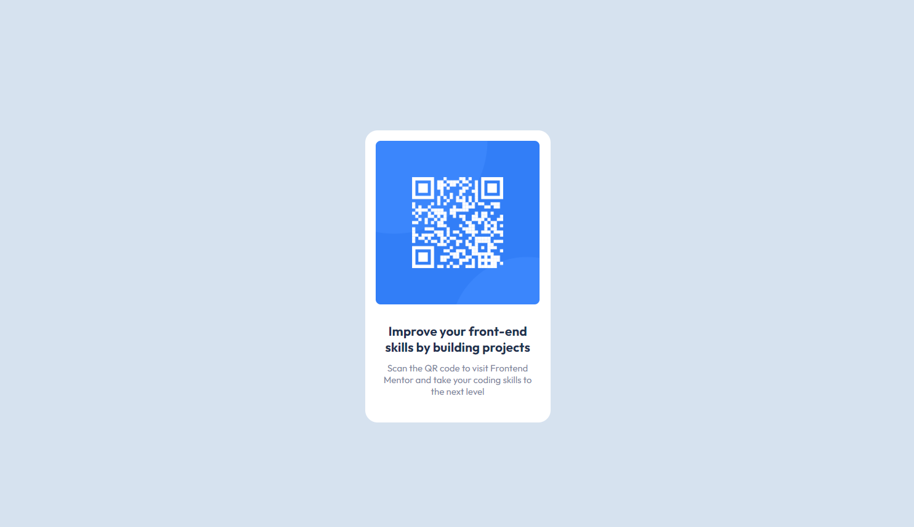

# Web Developer Journey: FrontEnd Mentor Challenge #2

## Frontend Mentor - QR code component solution

This is a solution to the [QR code component challenge on Frontend Mentor](https://www.frontendmentor.io/challenges/qr-code-component-iux_sIO_H). Frontend Mentor challenges help you improve your coding skills by building realistic projects. 

## Table of contents

- [Overview](#overview)
    - [Screenshot](#screenshot)
    - [Links](#links)
- [My process](#my-process)
    - [Built with](#built-with)
    - [Continued development](#continued-development)
  - [Author](#author)

# Overview

### Screenshot

### Links

- Solution URL: https://github.com/raszpberry/FrontEndMentor-2
- Live Site URL: https://raszpberry.github.io/FrontEndMentor-2/
- Watch me do this in timelapse at: https://youtu.be/Fivu6dhUp6E

# My process

### Built with

- Semantic HTML5 markup
- Mobile-first workflow

### Continued development

- Improve my use of css variables

## Author

- [Personal Website](https://raszpberry.github.io/rasz-web/#home)
- [GitHub](https://github.com/raszpberry)
- [CodePen](https://codepen.io/raszpberry)
- [Frontend Mentor](https://www.frontendmentor.io/profile/raszpberry)
- [Twitter](https://www.twitter.com/traszty)
- [Youtube](https://www.youtube.com/channel/UCoPKWMX2adD4bNw2njUdhBQ)

